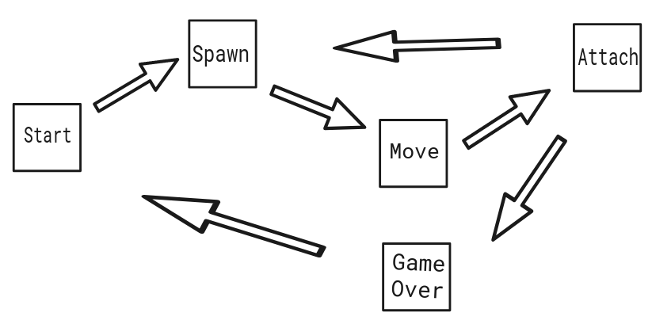

# **BrickGame v1.0**

## **Описание проекта**
Проект: "Тэтрис". Проект разделен на две ключевые части: "Backend" и "Frontend",  это обеспечивает понятную структру и возможную расширяемость в дальнейшем.

## **Backend**
Часть "Backend" была реализована на языке программирования C, с
реализацией конечного автомата состояний. Также была использована библиотека sqlite3-dev для сохранения рекордов пользователя. 
Сборка проекта с использованием Makefile, расположенного в папке src. Для установки приложения необходимо выполнить команду `make install`, для удаления - `make uninstall`, сборки проект - `make`.

## **Конечный автомат состояний**

## **Frontend**
Часть "Frontend" была создана с использованием языка программирования C и библиотеки Ncurses. Это обеспечивает красивый и удобный терминальный интерфейс для пользователя.

**Зависимости:**
- make
- libncurses-dev
- libsqlite3-dev